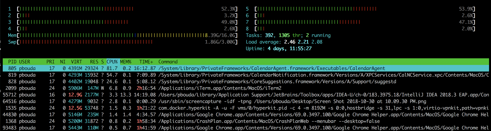

# threads-memory

```
java -Xmx512m \
--add-exports=java.management/sun.management=threads.memory \
--module-path target/classes \
--module threads.memory/pbouda.threads.memory.SimpleThreadsGenerator
```

### Changes of Stack Trace size
```
ThreadStackSize	        Thread Stack Size (in Kbytes)
VMThreadStackSize	    Non-Java Thread Stack Size (in Kbytes)
CompilerThreadStackSize	Compiler Thread Stack Size (in Kbytes)
```

`-Xss and -XX:ThreadStackSize`

- Same functionality
- The former one is default for the majority of JVMs
- The latter one is flag only for Hotspot

`jcmd <pid> VM.native_memory`

### Logging info about Threads

```
$ java -XX:+UnlockDiagnosticVMOptions -XX:NativeMemoryTracking=summary -XX:+PrintNMTStatistics -version

Native Memory Tracking:

Total: reserved=5724944KB, committed=354436KB
-                 Java Heap (reserved=4194304KB, committed=262144KB)
                            (mmap: reserved=4194304KB, committed=262144KB)

-                     Class (reserved=1056864KB, committed=4576KB)
                            (classes #426)
                            (  instance classes #364, array classes #62)
                            (malloc=96KB #454)
                            (mmap: reserved=1056768KB, committed=4480KB)
                            (  Metadata:   )
                            (    reserved=8192KB, committed=4096KB)
                            (    used=2839KB)
                            (    free=1257KB)
                            (    waste=0KB =0.00%)
                            (  Class space:)
                            (    reserved=1048576KB, committed=384KB)
                            (    used=270KB)
                            (    free=114KB)
                            (    waste=0KB =0.00%)

-                    Thread (reserved=15427KB, committed=15427KB)
                            (thread #15)
                            (stack: reserved=15360KB, committed=15360KB)
                            (malloc=50KB #84)
                            (arena=18KB #28)

-                      Code (reserved=247722KB, committed=7582KB)
                            (malloc=34KB #374)
                            (mmap: reserved=247688KB, committed=7548KB)

-                        GC (reserved=207299KB, committed=61379KB)
                            (malloc=17823KB #2090)
                            (mmap: reserved=189476KB, committed=43556KB)

-                  Compiler (reserved=306KB, committed=306KB)
                            (malloc=3KB #43)
                            (arena=303KB #11)

-                  Internal (reserved=545KB, committed=545KB)
                            (malloc=505KB #1063)
                            (mmap: reserved=40KB, committed=40KB)

-                    Symbol (reserved=1592KB, committed=1592KB)
                            (malloc=1072KB #2143)
                            (arena=520KB #1)

-    Native Memory Tracking (reserved=130KB, committed=130KB)
                            (malloc=4KB #50)
                            (tracking overhead=126KB)

-               Arena Chunk (reserved=675KB, committed=675KB)
                            (malloc=675KB)

-                   Logging (reserved=4KB, committed=4KB)
                            (malloc=4KB #177)

-                 Arguments (reserved=17KB, committed=17KB)
                            (malloc=17KB #463)

-                    Module (reserved=59KB, committed=59KB)
                            (malloc=59KB #1026)
```

```
$ java -Xlog:thread+os -version

[0.026s][info][os,thread] Thread attached (tid: 8963, pthread id: 4349997056).
[0.037s][info][os,thread] Thread started (pthread id: 123145494302720, attributes: stacksize: 1024k, guardsize: 4k, detached).
[0.037s][info][os,thread] Thread is alive (tid: 20227, pthread id: 123145494302720).
[0.037s][info][os,thread] Thread started (pthread id: 123145495363584, attributes: stacksize: 1024k, guardsize: 4k, detached).
.
.
[0.124s][info][os,thread] Thread started (pthread id: 123145508093952, attributes: stacksize: 1024k, guardsize: 4k, detached).
[0.124s][info][os,thread] Thread is alive (tid: 22275, pthread id: 123145508093952).
openjdk version "11" 2018-09-25
OpenJDK Runtime Environment 18.9 (build 11+28)
OpenJDK 64-Bit Server VM 18.9 (build 11+28, mixed mode)
[0.126s][info][os,thread] JavaThread detaching (tid: 8963).
[0.126s][info][os,thread] Thread attached (tid: 8963, pthread id: 4349997056).
[0.126s][info][os,thread] Thread finished (tid: 22275, pthread id: 123145508093952).
[0.126s][info][os,thread] Thread finished (tid: 12035, pthread id: 123145497485312).
[0.126s][info][os,thread] Thread finished (tid: 18947, pthread id: 123145498546176).
[0.126s][info][os,thread] Thread finished (tid: 11011, pthread id: 123145495363584).
[0.126s][info][os,thread] JavaThread exiting (tid: 17159).
[0.126s][info][os,thread] Thread finished (tid: 17159, pthread id: 123145502789632).
[0.126s][info][os,thread] JavaThread exiting (tid: 8963).
[0.139s][info][os,thread] Thread finished (tid: 12547, pthread id: 123145499607040).

```

### How many threads can I spawn?
RAM = 2BM
=> Heap 512MB
=> Off-Heap 300MB other processes
=> 1.2GB for spawning threads => 1200 Threads? no more

#### VSZ (virtual memory size)
- address space which is accessible by the process
- does not mean that there is enough physical memory

#### RES (resident set size)
- memory actually used by the process
- shows real memory usage 



### Cost of threads
- Stack Memory - 1MB by default, 
- Context-Switches
- Safepointing
- GC Roots

- `pstree` program
- processes and threads (from Java 10 Java Threads are properly named) 

### TODOs
- How it works in docker?